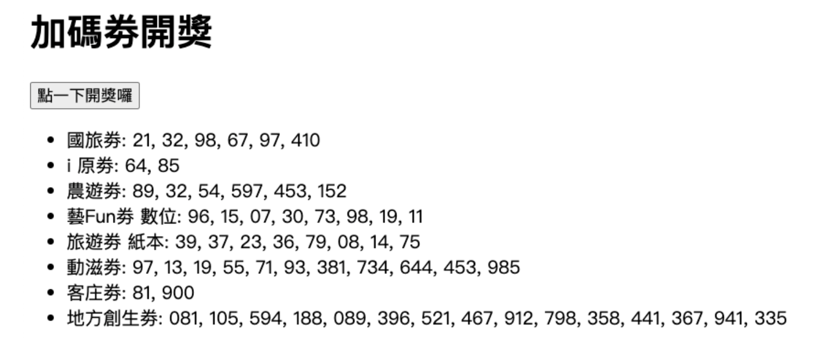
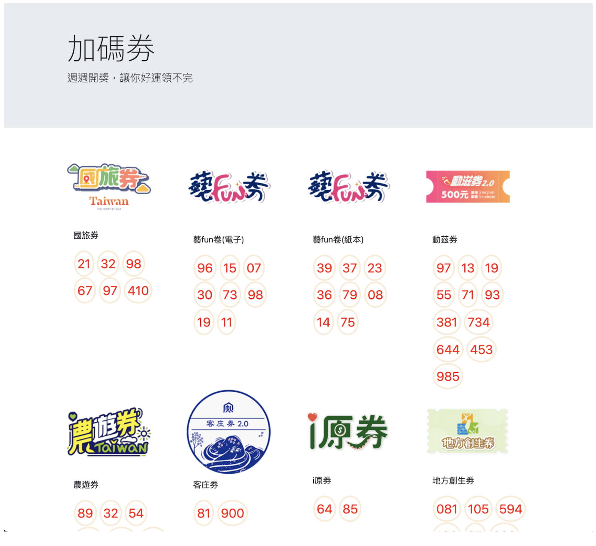

## 一、加碼券開獎 HTML 版 (35%)
如下方加碼券的畫面，請以 HTML/CSS 設計該畫面，並進行以下修改：
* 移除「點一下開獎囉」按鈕，直接呈現獎項內容。
標題和獎項內容整體風格置中左右有 margin，獎項條列仍為置左。
* 獎項名稱（如國旅券）的字體稍大，顏色改為藍色。
游標移到號碼（例如21) 時，底色會變成黃底。
（資料如第二題，可取用使用）



## 二、加碼券開獎 JS 版 (35%)
修改以下的程式碼，點擊後會出現如下的畫面

```html
<!DOCTYPE html>

<head>
<script>
let winNo1 = {
  "domesticTravel": ["21", "32", "98", "67", "97", "410"],
  "iYuan": ["64", "85"],
  "agriculture": ["89", "32", "54", "597", "453", "152"],
  "artFunE": ["96", "15", "07", "30", "73", "98", "19", "11"],
  "artFunP": ["39", "37", "23", "36", "79", "08", "14", "75"],
  "sports": ["97", "13", "19", "55", "71", "93", "381", "734", "644",   "453", "985"],
  "hakka": ["81", "900"],
  "rgionalRevitalization": ["081", "105", "594", "188", "089", "396", "521", "467", "912", "798", "358", "441", "367", "941", "335"]
};

let name_mapping = {
   "domesticTravel": "國旅劵",
   "iYuan": "i 原劵",
   "agriculture": "農遊劵",
   "artFunE": "藝Fun劵 數位",
   "artFunP": "旅遊劵 紙本",
   "sports": "動滋劵",
   "hakka": "客庄劵",
   "rgionalRevitalization": "地方創生劵"
};

function show() {
    let s = "<ul>";


    document.getElementById("#result").innerHTML = s;
}
</script>

</head>

<body>

   <h1> 加碼劵開獎 </h1>

   <input type="button" value="點一下開獎囉" onclick="show()">

   <div id="#result"></div>

</body>
```

## 三、加碼券開獎圖片版 (35%)

* 圖片可由 [這裡](https://drive.google.com/drive/folders/1Gd9Gt1jdhg7e_xUW_ubzoPK42ON7VP-W?usp=sharing) 取得
* 請使用 HTML/CSS 排版以完成下方畫面
* 亦可修改第二題 JS code 完成



> 超過 100 分以 100 分計
> 請誠實作答，可參考網路資料，勿使用 LLM 偷看與抄襲
